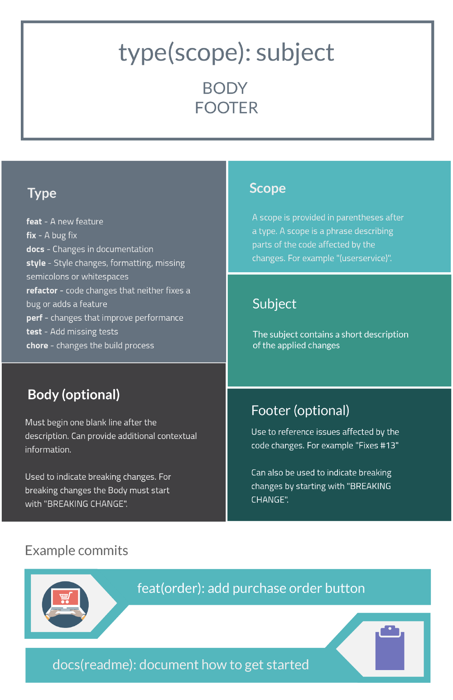

# MC949-Visao-Computacional

Template de projeto inspirado: Cookiecutter-data-science
https://cookiecutter-data-science.drivendata.org/#directory-structure

Divisão de pastas:
- data
    - interim: versoes dos dados originais, criar em subpastas nomeadas pelo padrão (stepDoTrab-iniciais-descricao) 
    - processed: versões final dos dados usados no canon do projeto (src)
    - raw: Dataset original em sua forma inalterada
- docs: documentação
    - subpastas referentes aos subescopos do projeto
- models: armazena modelos que serão criados
- notebooks: Playground de cada um para fins de pesquisa
    - criar conforme padrão de nomenclatura: stepDoTrab-initials-descricao
- src: Local do canone do projeto, ao final de pesquisa o código definitivo será posto aqui.


## Padrão de commit [Conventional commits]
https://www.conventionalcommits.org/en/v1.0.0/#summary 

### Instruções
- Usar os prefixos de type referentes ao tipo do commit (fig abaixo)
- Escopo    -> indicar o ID da task para rastreio no projeto github -> #1
- Mensagem  -> descrição da mudança 

Ex:  
**feat(#1): Tratamento incial dos dados**  
**docs(#2): explicação do algoritmo X**  
**refactor(#10): melhorando implementação do alg. Y**



## Execução de código
Primeiro cria-se o ambiente virtual python. Com o terminal aberto na pasta raiz do projeto, execute

```bash
python -m venv venv
```
Agora ativamos o ambiente virtual

Linux/macOS:
```bash
source venv/bin/activate
```
Windows:
```bash
.\venv\Scripts\Activate
```

E instalamos as bibliotecas 
```bash
pip install -r requirements.txt
```

### Type linting
Para ativar a execução do type linting (verificação de tipos) no código fonte, rode o seguinte comando ao abrir o venv:
```bash
pre-commit install
```
Agora antes de cada commit, o mypy rodará.

É possível ignorar a verificação com git commit --no-verify , mas não é o ideal.

## Download dos dados
Com o venv ativado, realize o download dos dados rodando o script

```bash
python src/canon/download_data.py
```